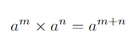

# Notas Para el Curso Previo de Matemática

1. [Propiedades de Potencias](#propiedades-de-las-potencias)

    - 1.1. [Propiedad de la multiplicación](#propiedad-de-la-multiplicación)
    - 1.2. [Propiedad de la división](#propiedad-de-la-división)
    - 1.3. [Propiedad de la potencia de una potencia](#propiedad-de-la-potencia-de-una-potencia)
    - 1.4. [Propiedad del cociente de potencias](#propiedad-del-cociente-de-potencias)
    - 1.5. [Potencia de un producto](#potencia-de-un-producto)
    - 1.6. [Potencia de un cociente](#potencia-de-un-cociente)
    - 1.7. [Potencia de exponente cero](#potencia-de-exponente-cero)
    - 1.8. [Potencia de exponente uno](#potencia-de-exponente-uno)
    - 1.9. [Potencia de base uno](#potencia-de-base-uno)
    - 1.10. [Potencia de base cero](#potencia-de-base-cero)
    - 1.11. [Potencia con exponente negativo](#potencia-con-exponente-negativo)
    - 1.12. [Potencia con exponente fraccionario](#potencia-con-exponente-fraccionario)

2.  [Propiedades de las Raíces](#propiedades-de-las-raíces)
    - 2.1. [Propiedad de la Raíz Cuadrada de un Producto](#propiedad-de-la-raíz-cuadrada-de-un-producto)
    - 2.2. [Propiedad de la Raíz Cuadrada de un Cociente](#propiedad-de-la-raíz-cuadrada-de-un-cociente)
    - 2.3. [Propiedad de la Raíz Cuadrada de una Potencia](#propiedad-de-la-raíz-cuadrada-de-una-potencia)
    - 2.4. [Propiedad de la Potenciación de una Raíz Cuadrada](#propiedad-de-la-potenciación-de-una-raíz-cuadrada)
    - 2.5. [Propiedad de la Radicación de una Potencia](#propiedad-de-la-radicación-de-una-potencia)
    - 2.6. [Propiedad de la Raíz de una Suma](#propiedad-de-la-raíz-de-una-suma)
    - 2.7. [Propiedad de la Raíz de una Resta](#propiedad-de-la-raíz-de-una-resta)

## Propiedades de las Potencias
---
### Propiedad de la multiplicación
Si tienes dos potencias con la misma base, puedes multiplicarlas manteniendo la base y sumando los exponentes:

---

### Propiedad de la división
Al dividir dos potencias con la misma base, puedes restar los exponentes manteniendo la base:

---

### Propiedad de la potencia de una potencia
Cuando tienes una potencia elevada a otra potencia, puedes multiplicar los exponentes:

---

### Propiedad del cociente de potencias
Para el cociente de dos potencias con la misma base, restas los exponentes:

---

### Potencia de un producto
Al elevar un producto a una potencia, puedes distribuir la potencia a cada factor:

---

### Potencia de un cociente
Al elevar un cociente a una potencia, puedes distribuir la potencia a cada término del cociente:

---

### Potencia de exponente cero
Cualquier número elevado a cero es igual a uno:

---

### Potencia de exponente uno
Cualquier número elevado a uno es igual a sí mismo:

---

### Potencia de base uno
Uno elevado a cualquier exponente es igual a uno:

---

### Potencia de base cero
Cualquier número diferente de cero elevado a cero no tiene un valor definido.

---

### Potencia con exponente negativo
Una potencia con exponente negativo se puede expresar como la inversa de la misma potencia con exponente positivo:

### Potencia con exponente fraccionario
Una potencia con exponente fraccionario se puede expresar como la raíz correspondiente de la misma base:

## Propiedades de las Raíces

---

### Propiedad de la Raíz de un Producto

Para cualquier par de números reales \( a \) y \( b \), y entero positivo \( n \), se cumple que:

---

### Propiedad de la Raíz de un Cociente

Para cualquier par de números reales \( a \) y \( b \), donde \( b \neq 0 \), y entero positivo \( n \), se cumple que:

---

### Propiedad de la Raíz de una Potencia

Para cualquier número real \( a \) y entero positivo \( n \), se cumple que:

---

### Propiedad de la Potenciación de una Raíz

Para cualquier número real \( a \) y entero positivo \( n \), se cumple que:

---

### Propiedad de la Radicación de una Potencia

Para cualquier número real no negativo \( a \), entero positivo \( n \) y entero \( m \), se cumple que:

---

### Propiedad de la Raíz de una Suma

Para cualquier par de números reales \( a \) y \( b \), y entero positivo \( n \), se cumple que:

---

### Propiedad de la Raíz de una Resta

Para cualquier par de números reales \( a \) y \( b \), y entero positivo \( n \), se cumple que:

