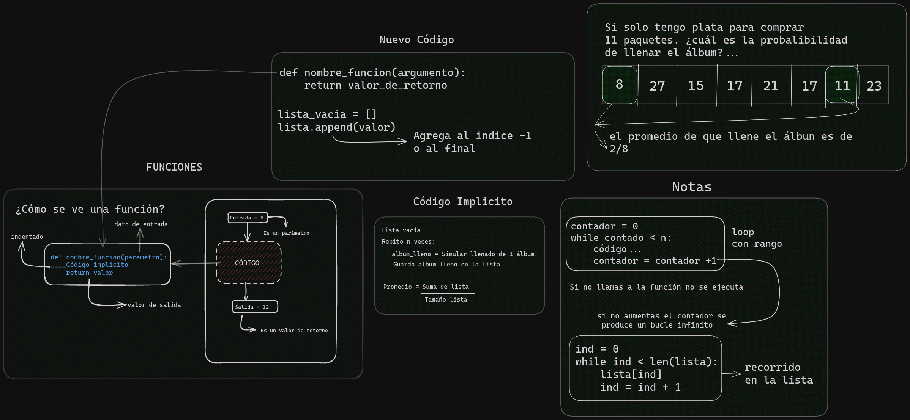

# Temas Abordados en la clase 4 de Pensamiento Computacional.

### [Respondemos sobre figus simulando](./respuestaFiguritas.ipynb)

En esta parte de la clase exploramos cómo simular el proceso de recolección de figuritas para un álbum. Utilizamos técnicas de programación para modelar este proceso y generar respuestas simuladas a diferentes situaciones.

### [Condicionales](./condicionales.ipynb)

Durante la clase, estudiamos el uso de condicionales en Python. Estas estructuras de control nos permiten tomar decisiones basadas en ciertas condiciones. Practicamos su aplicación en contextos como el llenado del álbum de figuritas.

### [Recorrer listas](./recorrerLista.ipynb)

Recorrer listas es una habilidad fundamental en programación. En esta sesión, repasamos cómo iterar sobre elementos de una lista y acceder a cada uno de ellos. Esto resultó útil para manipular la información relacionada con las figuritas en nuestro programa.

### [Sacar promedio](./sacarPromedio.ipynb)

Calcular el promedio es una operación común en análisis de datos y estadísticas. En la clase, vimos cómo calcular el promedio de un conjunto de valores utilizando Python. Esta habilidad es útil en una variedad de contextos, incluido el procesamiento de datos en nuestro programa de álbum de figuritas.

### [Funciones](../clase02/funciones.ipynb)

Las funciones nos permiten organizar y reutilizar código de manera eficiente. Durante la clase, aprendimos a definir y utilizar funciones en Python para encapsular tareas específicas. Esto facilita la modularidad y mantenibilidad del código.

### [.append()](./append.ipynb)

El método `append()` en Python se utiliza para agregar un elemento al final de una lista.

## Actividades

1. Hacer un programa que simule el llenado de un álbum dinámicamente: Durante la sesión, se asignó esta tarea para que los estudiantes aplicaran los conceptos aprendidos sobre condicionales, recorrido de listas y funciones en la creación de un programa que simule el llenado de un álbum de figuritas. [actividad03.py](../../ejercicios/ejercicio03.py) 
   [Respuesta](../../ejercicios/respuestas/ejercicio03.py)

2. Establecer un valor máximo para la cantidad de figuritas que el usuario puede comprar (11): Para promover la práctica de la lógica condicional, se propuso limitar la cantidad máxima de figuritas que un usuario puede comprar en una sola transacción. 
   más información-->[actividad04.py](../../ejercicios/ejercicios04.py) [Respuesta](../../ejercicios/respuestas/ejercicios04.py)

# NOTAS DE LA CLASE

- Un programa es una forma de expresar una solución: Se enfatizó la importancia de la programación como una herramienta para resolver problemas y expresar soluciones de manera sistemática y estructurada.
