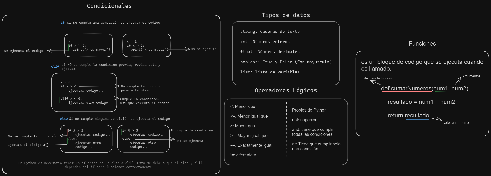

# Temas abordados en la clase 4 de pensamientos computacional.

### [Repaso condicionales](../clase03/condicionales.ipynb)

### [Repaso Funciones](../clase02/funciones.ipynb)

### volvemos al 7 y medio.

[ejercicio](../../ejercicios/ejercicio05.py)
[Respuesta](../../ejercicios/respuestas/)
