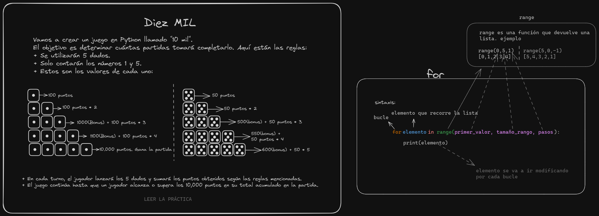

# Temas de la clase 5 de pensamiento computacional

## [Bucle for](./for.ipynb):

La sentencia `for` se utiliza para ejecutar bucles finitos, lo que significa que sabemos que terminarán en algún momento y no continuarán por una acción.

## [Range()](./range.ipynb):

La función `range` devuelve una lista ordenada de números.

## Ejercicio:

- Ver el pizarrón o [ver pdf](https://campus.exactas.uba.ar/pluginfile.php/554933/mod_resource/content/3/03-consigna-diez_mil.pdf).
- Respuesta: [Se subirá cuando pase la fecha de entrega](./)
